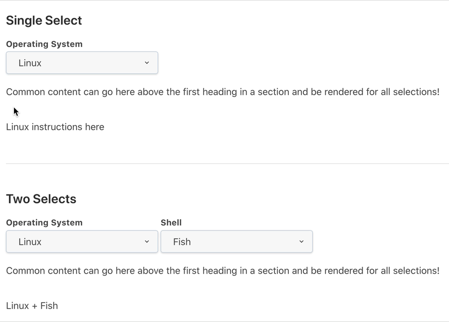

# docsify-select

  

A [docsify.js](https://docsify.js.org) plugin for variably rendering content with HTML select menus defined in markdown.

## Features

- Single select menus
- Multi select menus
- Complex multi-select menus with partial selections and default content
- Compatible with [`docsify-tabs`](https://github.com/jhildenbiddle/docsify-tabs)
- Automatically detect operating system and select options for menus with specific labels

## [Documentation & Demos](https://jthegedus.github.io/docsify-select/)

## Credit

Adapted from [jhildenbiddle's](https://github.com/jhildenbiddle/) `docsify-tabs` plugin, so many thanks to them.

## Contributing

[Contributions of any kind welcome, just follow the guidelines](contributing.md)!

### Contributors

[Thanks goes to these contributors](https://github.com/jthegedus/docsify-select/graphs/contributors)!

## License

[MIT License](license)
